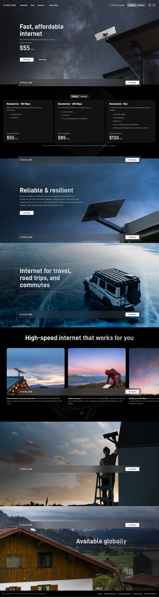
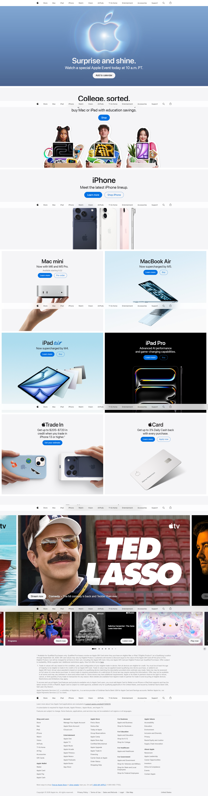

# Full Page Screenshot

A Chrome extension that captures an entire webpage as one continuous screenshot.

## Load in Chrome

1. Open `chrome://extensions`.
2. Enable **Developer mode**.
3. Select **Load unpacked**.
4. Choose this project folder.
5. Open the extension from the toolbar and select **Capture Full Page**.

## Permissions

- `activeTab` and `scripting` allow the extension to inspect and capture the current tab.
- `downloads` saves the completed screenshot to the local Downloads folder.

## Sample

